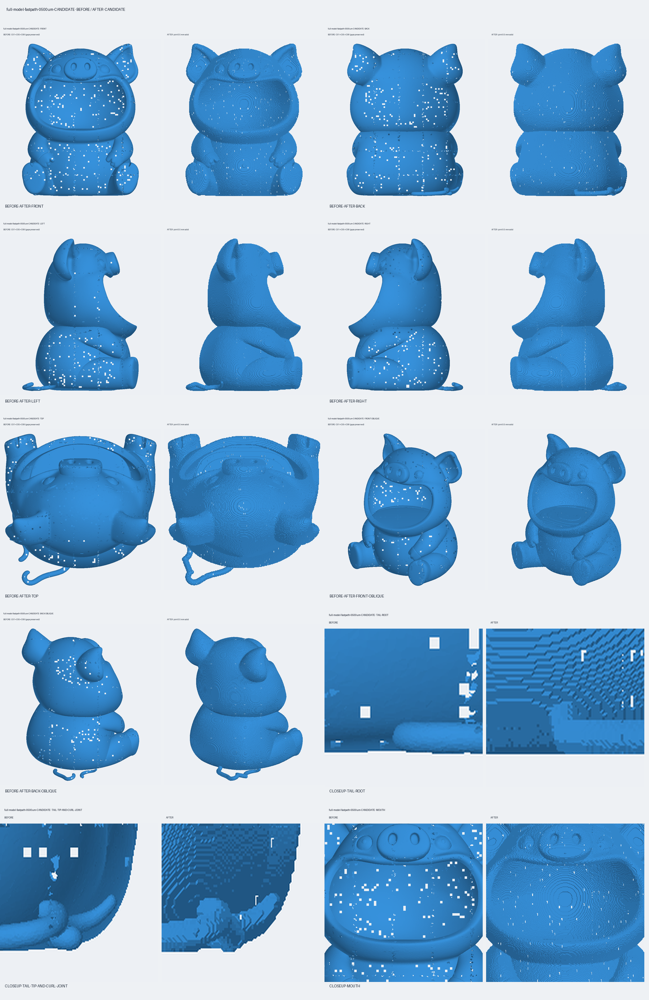
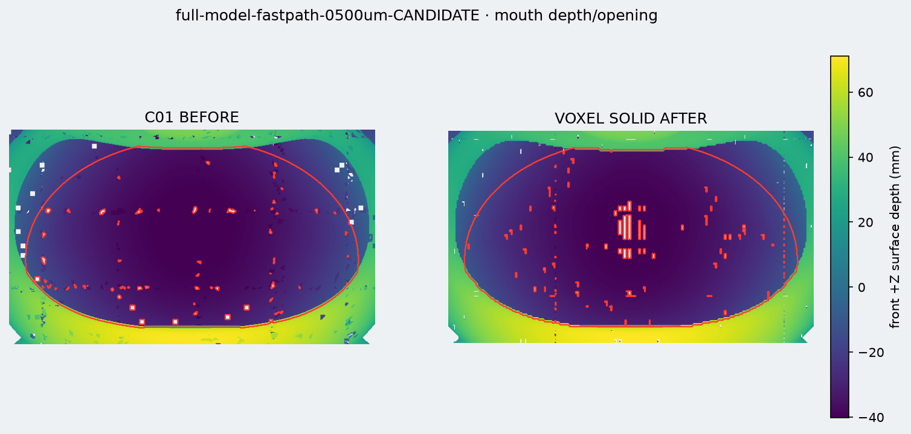

# Formerhalt- und Schwanzbericht

Status: **PASS / CANDIDATE / NON-MASTER**

## Auswahl der Schwanzgeometrie

Die vier getrennten Schwanzkomponenten wurden vor dem Build einzeln und paarweise untersucht. Keine Komponente hatte Selbstschnitte.

| Teil | V/F | Topologie | Abstand zu C01 | Entscheidung |
|---|---:|---|---:|---|
| C05 | 1.479 / 2.954 | watertight, manifold, 0 Boundary/NM | 3,322 mm | sichtbarer langer Außenteil: behalten |
| C07 | 1.369 / 2.733 | nicht watertight, 2 Boundary, 1 NM, 3 ungültige Links | 3,675 mm | Gegen-/Innenlage zu C05; ausgeschlossen |
| C08 | 792 / 1.580 | watertight, manifold, 0 Boundary/NM | 5,446 mm | sichtbarer Curl-/Endteil: behalten |
| C09 | 713 / 1.422 | watertight, manifold, 0 Boundary/NM | 5,809 mm | Gegenlage zu C08; ausgeschlossen |

C05↔C07 liegen nur **0,255 mm**, C08↔C09 nur **0,272 mm** auseinander: klare Doppelhautpaare. C05↔C08 hatten dagegen **10,392 mm** echten Abstand. Der Referenzrender zeigt einen zusammenhängenden Ringelschwanz; daher wurden ausschließlich zwei lokale runde Verbindungen mit 2,5-mm-Nennradius zwischen den exakten Mindestabstands-Zeugen eingefügt:

- C05→C01: 3,322 mm Oberflächenlücke
- C05→C08: 10,392 mm Oberflächenlücke

Keine breite Brücke, keine zweite Haut, kein morphologisches Closing. Danach wurden C01+C05+C08+Verbindungen gemeinsam in einem 0,5-mm-Raster zu einem Solid rekonstruiert.

Gemessene minimale Durchmesser entlang der mittleren 70 % der rekonstruierten Verbindungsachsen:

- Schwanzwurzel: **5,622 mm**
- C05/C08-Curl-Übergang: **5,533 mm** – dünnste gemessene Verbindungsstelle

Visuell ist der Schwanz nun bodennah, am Körper angebunden und durchgehend. Am Curl-Übergang bleibt ein kleiner runder Knoten sichtbar; er ist lokal, druckbar und wurde nicht durch Glättung kaschiert.

## Formerhalt

Die relevante Außenabweichung ist Kandidat→sichtbarer Konstruktionsinput:

- flächengewichteter Median: **0,332 mm**
- p95: **0,475 mm**
- p99: **ca. 0,505 mm**
- gemessenes Maximum: **0,704 mm**

Erhalt der ausgewählten Schwanzoberflächen:

- C05→Kandidat: Median 0,305 mm; p95 0,453 mm; Maximum 2,542 mm
- C08→Kandidat: Median 0,308 mm; p95 0,459 mm; Maximum 2,539 mm

Die Maxima liegen erwartungsgemäß in den lokal überblendeten Anschlussbereichen. Außerhalb dieser Verbindungen folgt das Ergebnis dem 0,5-mm-Raster.

Die umgekehrte C01→Kandidat-Richtung besitzt p95 3,318 mm, weil C01 nichtautoritative, später gefüllte/entfernte innere und überlagerte Flächen enthält. Sie ist kein Maß für die äußere Sichtabweichung; derselbe asymmetrische Wert lag bereits beim eingefrorenen erfolgreichen C01-Smoke-Test vor.

## Kritische sichtbare Bereiche

- Maulöffnung erkannt: PASS
- keine Frontmembran: PASS
- projizierte Maulfläche: **98,683 %** von C01
- Maulbreite: **100,263 %**
- Maulhöhe: **98,948 %**
- Tiefenkontrast: **98,839 %**
- Ohren: Median 0,319 mm; p95 0,446 mm
- Füße: Median 0,299 mm; p95 0,453 mm

Die automatischen groben Snout-/Hand-Bänder enthalten die bereits bekannte C01-Asymmetrie bzw. gefüllte innere Flächen und weisen deshalb lokale hohe source→candidate-Ausreißer auf. Die Vollansichten zeigen keine neue grobe Verschmelzung, abgeschnittene Extremität oder falsche Silhouette.

Hinweis zu den Vorschaubildern: einzelne weiße quadratische Pixel sind bekannte AMD-nvdiffrast-Raster-Dropouts. Sie sind keine Meshlöcher; Topologie, Format-Roundtrips und Slicer melden eine geschlossene Hülle.

